# RHOAI Argo — Install Parameter & Dependency Architecture

This diagram traces how install parameters flow from the top-level `app-of-apps.yaml`
`Application` CR, through the `argocd-applications` App-of-Apps Helm chart, down into
each child Helm chart's conditional resources.

> Generated from a walkthrough of the repo. Not auto-synced with code — regenerate/update
> by hand if the chart structure or values change significantly.

```mermaid
flowchart TD
    U["oc apply -f app-of-apps.yaml"] --> AOA

    subgraph ENTRY["Top-Level Application (app-of-apps.yaml)"]
        AOA["valuesObject override<br/>installPlanApproval: Manual<br/>addSelfSignedCerts: true<br/>externalDatabase: false<br/>configuration.gpuApp.nvidiaGpu*<br/>configuration.rhoaiApp.externalDatabase: false"]
    end

    AOA -->|"Helm valuesObject<br/>(deep-merged over chart defaults)"| CFG

    subgraph CFG["Helm Chart: argocd-applications (App-of-Apps)"]
        direction TB
        DEF["values.yaml defaults<br/>installPlanApproval=Manual&nbsp; addSelfSignedCerts=false<br/>externalDatabase=true<br/>kueue=Unmanaged&nbsp; trainer=Managed&nbsp; spark=Managed&nbsp; maas=Managed"]
        FLAGS["Master enable switches<br/>enableInfrastructureApp&nbsp; enableWorkloadScalingApp<br/>enableObservabilityApp&nbsp; enableGpuApp<br/>enableInferenceApp&nbsp; enableRhoaiApp"]
        PERAPP["configuration.&lt;app&gt; blocks<br/>(databaseApp, gpuApp, inferenceApp,<br/>infrastructureApp, observabilityApp,<br/>rhoaiApp, selfSignedCerts, workloadScalingApp)"]
        DEF --> FLAGS --> PERAPP
    end

    %% ---- Gating diamonds for each Application template ----
    G1{"enableInfrastructureApp"}
    G2{"enableWorkloadScalingApp"}
    G3{"enableObservabilityApp"}
    G4{"NOT enableDatabaseManager*<br/>OR addSelfSignedCerts"}
    G5{"NOT externalDatabase"}
    G6{"enableGpuApp"}
    G7{"enableInferenceApp AND<br/>enableObservabilityApp"}
    G8{"enableRhoaiApp"}

    FLAGS --> G1
    FLAGS --> G2
    FLAGS --> G3
    FLAGS --> G4
    DEF --> G5
    FLAGS --> G6
    G3 --> G7
    FLAGS --> G7
    FLAGS --> G8

    G1 -->|true| A1
    G2 -->|true| A2
    G3 -->|true| A3
    G4 -->|true| A4
    G5 -->|true| A5
    G6 -->|true| A6
    G7 -->|true| A7
    G8 -->|true| A8

    A1(["Application: infrastructure-utility-operators<br/>wave 0"])
    A2(["Application: workload-scaling-operators<br/>wave 0"])
    A3(["Application: observability-operators<br/>wave 0"])
    A4(["Application: self-signed-certs<br/>wave 0"])
    A5(["Application: database-manager<br/>wave 10"])
    A6(["Application: gpu-operator-installation<br/>wave 10"])
    A7(["Application: inference-stack-operators<br/>wave 20"])
    A8(["Application: rhoai-deployment<br/>wave 30"])

    PERAPP -.->|"configuration.infrastructureApp"| A1
    PERAPP -.->|"configuration.workloadScalingApp<br/>(kueue, trainer, installPlanApproval)"| A2
    PERAPP -.->|"configuration.observabilityApp<br/>(cooVersion)"| A3
    PERAPP -.->|"configuration.selfSignedCerts"| A4
    PERAPP -.->|"configuration.databaseApp<br/>(maasDb.enableMaas, storage)"| A5
    PERAPP -.->|"configuration.gpuApp<br/>(nvidiaGpu*, enableRdma)"| A6
    PERAPP -.->|"configuration.inferenceApp<br/>(rhclVersion)"| A7
    PERAPP -.->|"configuration.rhoaiApp<br/>(huge block: dataScienceCluster.*,<br/>maas/kueue/trainer/spark, dashboardConfig)"| A8

    %% ===================== CHILD CHART: infrastructure-utilities =====================
    subgraph C1["helm/infrastructure-utilities"]
        direction TB
        C1_KMM["05-kmm.yaml<br/>(Kernel Module Mgmt operator)<br/>unconditional"]
    end
    A1 --> C1_KMM

    %% ===================== CHILD CHART: workload-scaling =====================
    subgraph C2["helm/workload-scaling"]
        direction TB
        C2_CMA["05-cma-operator.yaml<br/>(Custom Metrics Autoscaler)<br/>unconditional"]
        C2_CMACfg["07-cma-controller.yaml<br/>unconditional"]
        C2_KueueGate{"kueue != Removed"}
        C2_Kueue["05-rhbok.yaml<br/>(Red Hat build of Kueue)"]
        C2_TrainerGate{"trainer != Removed"}
        C2_JobSet["05-job-set.yaml (JobSet operator)"]
        C2_JobSetCfg["07-cluster-job-set.yaml (ClusterJobSet CR)"]
        C2_KueueGate -->|true| C2_Kueue
        C2_TrainerGate -->|true| C2_JobSet
        C2_TrainerGate -->|true| C2_JobSetCfg
    end
    A2 --> C2_CMA & C2_CMACfg & C2_KueueGate & C2_TrainerGate

    %% ===================== CHILD CHART: observability-stack =====================
    subgraph C3["helm/observability-stack"]
        direction TB
        C3_OTEL["05-open-telemetry.yaml<br/>unconditional"]
        C3_Tempo["05-tempo.yaml<br/>unconditional"]
        C3_UWM["05-user-workload-monitoring.yaml<br/>unconditional"]
        C3_COOGate{"cooVersion set?"}
        C3_COO["05-cluster-observability.yaml<br/>(pins operator channel/CSV)"]
        C3_COOGate -->|true| C3_COO
    end
    A3 --> C3_OTEL & C3_Tempo & C3_UWM & C3_COOGate

    %% ===================== CHILD CHART: self-signed-certs =====================
    subgraph C4["helm/self-signed-certs"]
        direction TB
        C4_SelfIssuer["00-cluster-issuer.yaml<br/>ClusterIssuer: selfsigned-issuer"]
        C4_CAIssuer["00-cluster-issuer.yaml<br/>ClusterIssuer: ca-issuer"]
        C4_Cert["00-certificate.yaml<br/>(cert-manager-ca secret)"]
    end
    A4 --> C4_SelfIssuer & C4_CAIssuer & C4_Cert

    %% ===================== CHILD CHART: database-stack =====================
    subgraph C5["helm/database-stack"]
        direction TB
        C5_CNPG["05-cloud-native-pg.yaml<br/>(CloudNativePG operator)<br/>unconditional"]
        C5_MaasGate{"maasDb.enableMaas != Removed"}
        C5_NS["00-maas-namespace.yaml"]
        C5_CertReq["10-maas-certificate.yaml<br/>(Certificate, issuerRef: ca-issuer)"]
        C5_DB["15-maas-db.yaml (Postgres Cluster CR)"]
        C5_MaasGate -->|true| C5_NS --> C5_CertReq --> C5_DB
    end
    A5 --> C5_CNPG & C5_MaasGate
    C4_CAIssuer -.->|"issuerRef dependency"| C5_CertReq

    %% ===================== CHILD CHART: gpu-operator-installation =====================
    subgraph C6["helm/gpu-operator-installation"]
        direction TB
        C6_NFDOp["10-nfd-operator.yaml<br/>unconditional"]
        C6_NFDInst["15-nfd-instance.yaml<br/>unconditional"]
        C6_SRIOV["20-sriov.yaml (SR-IOV Network operator)<br/>unconditional"]
        C6_GPUOpGate{"nvidiaGpuVersion set?"}
        C6_GPUOp["40-gpu-operator.yaml<br/>pins channel/CSV/driver version"]
        C6_RdmaGate{"enableRdma"}
        C6_NMState["30-network-manager-operator.yaml"]
        C6_SriovCfg["25-sriov-config.yaml"]
        C6_ClusterPolicy["45-gpu-clusterpolicy.yaml<br/>(+ RDMA section if enableRdma)"]
        C6_GPUOpGate -->|true| C6_GPUOp
        C6_RdmaGate -->|true| C6_NMState
        C6_RdmaGate -->|true| C6_SriovCfg
        C6_GPUOp --> C6_ClusterPolicy
        C6_RdmaGate -.->|"adds RDMA block"| C6_ClusterPolicy
    end
    A6 --> C6_NFDOp --> C6_NFDInst --> C6_SRIOV --> C6_GPUOpGate & C6_RdmaGate

    %% ===================== CHILD CHART: inference-stack =====================
    subgraph C7["helm/inference-stack"]
        direction TB
        C7_LWS["05-leader-worker-set.yaml<br/>unconditional"]
        C7_GwClass["15-gateway-class.yaml<br/>unconditional"]
        C7_GwCfg["16-gateway-config.yaml<br/>unconditional"]
        C7_AuthorinoCfg["11-authorino-configuration.yaml<br/>+11-authorino-service-configuration.yaml"]
        C7_Kuadrant["11-kuadrant.yaml"]
        C7_RhclGate{"rhclVersion set?"}
        C7_RHCL["10-rhcl.yaml<br/>(Red Hat Connectivity Link operator,<br/>pins CSV version)"]
        C7_RhclGate -->|true| C7_RHCL --> C7_AuthorinoCfg --> C7_Kuadrant
    end
    A7 --> C7_LWS & C7_GwClass & C7_GwCfg & C7_RhclGate

    %% ===================== CHILD CHART: rhoai-stack =====================
    subgraph C8["helm/rhoai-stack"]
        direction TB
        C8_OpGate{"rhoaiVersion set?"}
        C8_Op["30-rhoai-operator.yaml<br/>(Subscription, pins channel/CSV,<br/>installPlanApproval)"]
        C8_OpDeploy["32-operator-deployment.yaml<br/>(operatorReplicas)"]
        C8_DSCIC["31-datascienceclusterinitialization.yaml<br/>(monitoring storage size/retention)"]
        C8_DSCGate{"dataScienceCluster.create"}
        C8_DSC["33-datasciencecluster.yaml<br/>per-component managementState:<br/>kserve/maas, kueue, trainer, spark,<br/>workbenches, dashboard, ray, etc."]
        C8_DashDeploy["35-dashboard-deployment.yaml<br/>(dashboardReplicas)"]
        C8_DashCfg["35-odhdashboardconfig.yaml<br/>(genAiStudio, modelAsService,<br/>observabilityDashboard,<br/>notebook/model server sizes)"]
        C8_SparkGate{"spark != Removed"}
        C8_SparkUI["35-enable-spark-ui.yaml"]
        C8_SparkNP["35-spark-network-policy.yaml"]
        C8_MaasGate{"maas != Removed AND<br/>NOT externalDatabase"}
        C8_MaasDb["40-maas-db-*.yaml<br/>(ServiceAccount/ConfigMap/RoleBinding)<br/>+41-maas-db-config-job.yaml"]

        C8_OpGate -->|true| C8_Op --> C8_OpDeploy --> C8_DSCIC --> C8_DSCGate
        C8_DSCGate -->|true| C8_DSC --> C8_DashDeploy --> C8_DashCfg
        C8_DSC --> C8_SparkGate
        C8_SparkGate -->|true| C8_SparkUI & C8_SparkNP
        C8_DSC --> C8_MaasGate
        C8_MaasGate -->|true| C8_MaasDb
    end
    A8 --> C8_OpGate
    C5_DB -.->|"DB must exist before<br/>maas-db-config-job runs"| C8_MaasDb
```

## How to read it

**1. Single entry point, two layers of values merging**
`app-of-apps.yaml` only overrides a handful of fields (`installPlanApproval`,
`addSelfSignedCerts`, `externalDatabase`, a slice of `configuration.gpuApp`,
`configuration.rhoaiApp.externalDatabase`). Everything else falls back to
`argocd-applications/values.yaml`. Helm does a deep merge, so this top file is really a
"diff" on top of the chart defaults — not a full picture of what gets installed.

**2. The "App-of-Apps" fan-out (8 children, 4 distinct conditions)**

| Application | Condition | Sync wave |
|---|---|---|
| `infrastructure-utility-operators` | `enableInfrastructureApp` | 0 |
| `workload-scaling-operators` | `enableWorkloadScalingApp` | 0 |
| `observability-operators` | `enableObservabilityApp` | 0 |
| `self-signed-certs` | `not .Values.enableDatabaseManager` **OR** `addSelfSignedCerts` | 0 |
| `database-manager` | `not .Values.externalDatabase` | 10 |
| `gpu-operator-installation` | `enableGpuApp` | 10 |
| `inference-stack-operators` | `enableInferenceApp` **AND** `enableObservabilityApp` | 20 |
| `rhoai-deployment` | `enableRhoaiApp` | 30 |

⚠️ **Known bug**: `00-self-signed-certs.yaml` checks `.Values.enableDatabaseManager`,
but no such key exists anywhere in `values.yaml` — it's likely meant to be
`externalDatabase` (mirroring the `database-manager` condition). As written,
`enableDatabaseManager` always evaluates to `nil`, so `not nil` is always `true`, meaning
**`self-signed-certs` deploys unconditionally** regardless of `addSelfSignedCerts`.

**3. Three "shared anchor" values fan out across multiple charts**
`kueue`, `trainer`, `spark`, and `maas` are defined once via YAML anchors in
`argocd-applications/values.yaml` and reused in both `configuration.workloadScalingApp`
and `configuration.rhoaiApp`. The same toggle (e.g. `maas: Managed`) independently gates
resources in three different charts:
- `database-stack` (deploys the MaaS Postgres DB) — gated on `maasDb.enableMaas != Removed`
- `rhoai-stack` (KServe `modelsAsService` component + MaaS DB role bindings) — gated on
  `maas != Removed`
- the `database-manager` Application itself is gated on the *separate* `externalDatabase`
  flag, not `maas`

So to fully disable MaaS you need `maas: Removed` **and** `rhoai-stack`'s DB-config
templates additionally check `externalDatabase` — turning on `externalDatabase: true` is
what currently suppresses the database chart's deployment (per `app-of-apps.yaml`), while
`maas` independently still drives the KServe component state.

**4. Cross-chart runtime dependency (ordered only by sync-wave, not Argo `dependsOn`)**
`self-signed-certs` creates the `ca-issuer` `ClusterIssuer` (wave 0), which
`database-stack`'s `Certificate` resource references via `issuerRef` (wave 10). Similarly,
the MaaS Postgres `Cluster` (`database-stack`, wave 10) must be `Ready` before
`rhoai-stack`'s `41-maas-db-config-job` (wave 41) can run. These aren't Argo `Application`
dependencies — they're purely ordered by the numeric sync-wave convention baked into each
manifest's annotations, so a misconfigured wave number is the most likely failure mode if
someone edits these charts.

**5. README drift**
The `README.md`'s "Repository Structure" section is out of date — `rhcl`/Connectivity Link
and SR-IOV have moved from `infrastructure-utilities` into `inference-stack` and
`gpu-operator-installation` respectively, `leader-worker-set` moved from
`workload-scaling` into `inference-stack`, and there's no mention of the `database-stack`
chart at all (which is now a first-class, conditionally-deployed Application).
